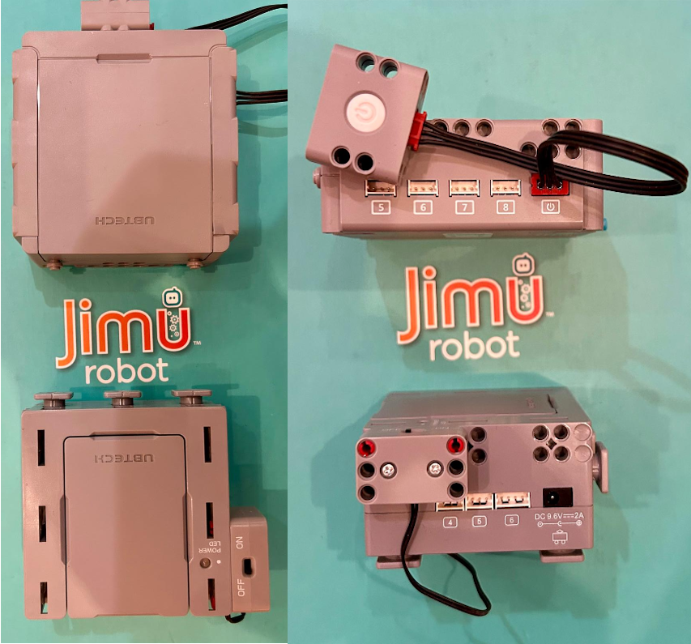
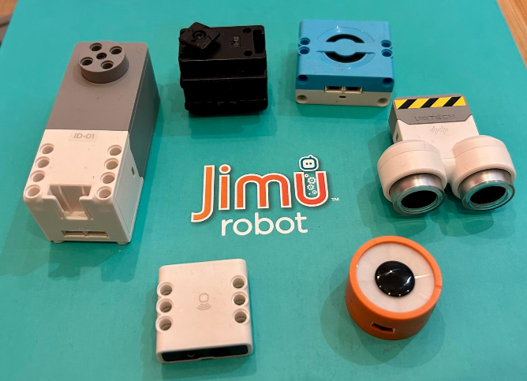
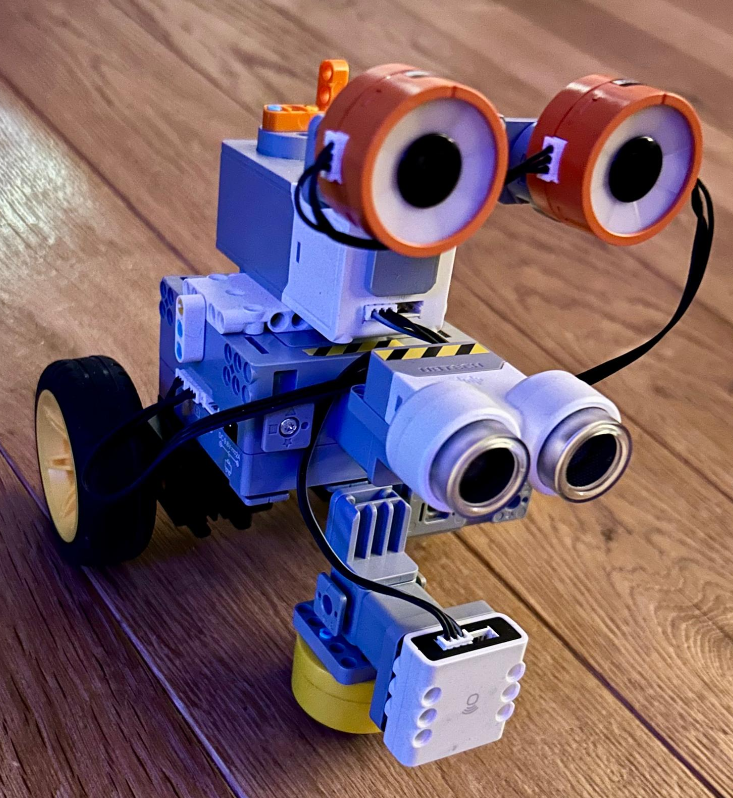
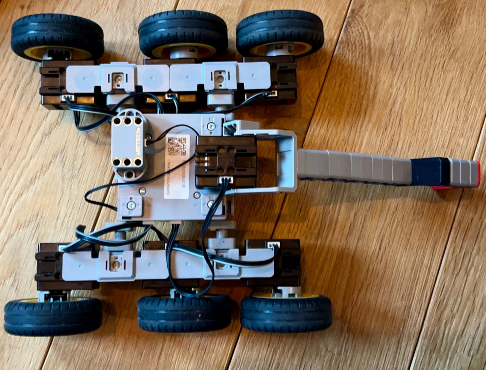
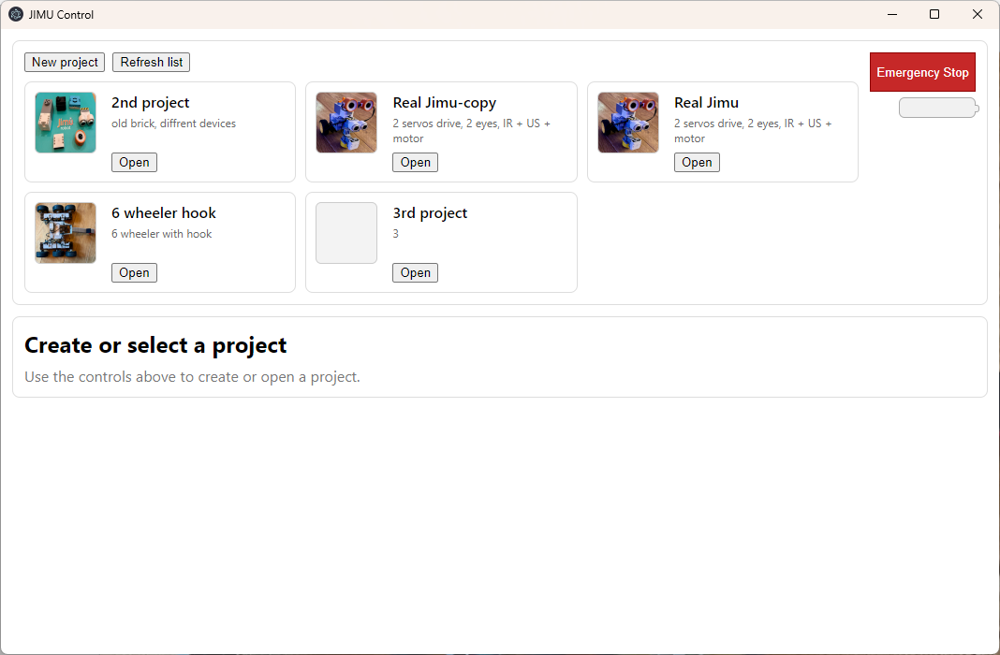
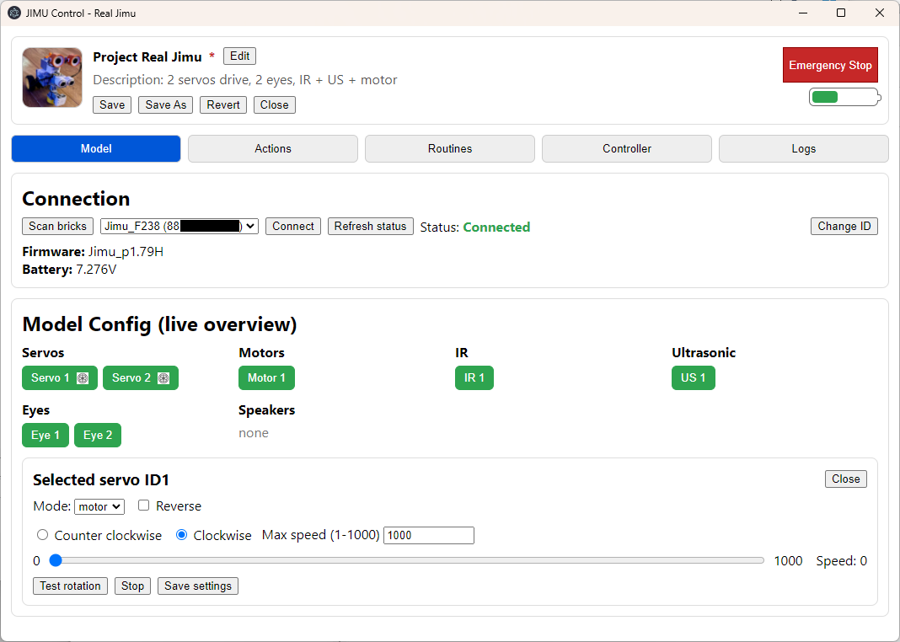
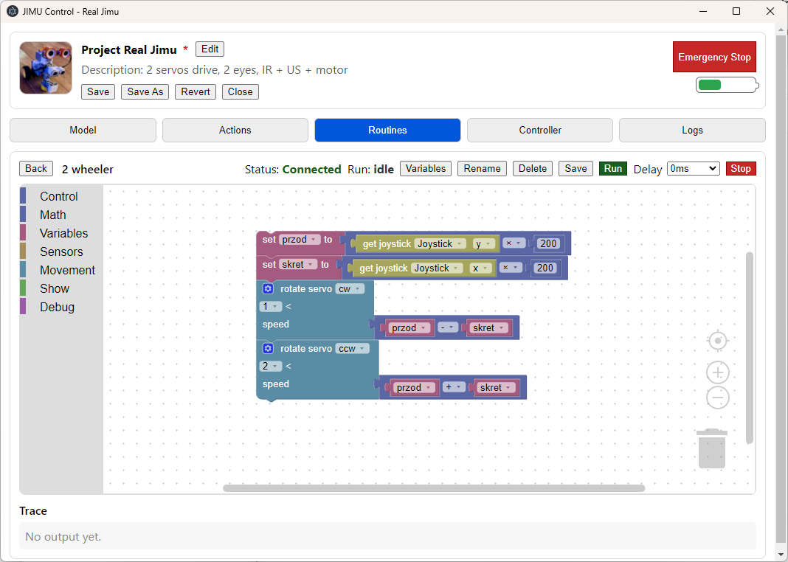
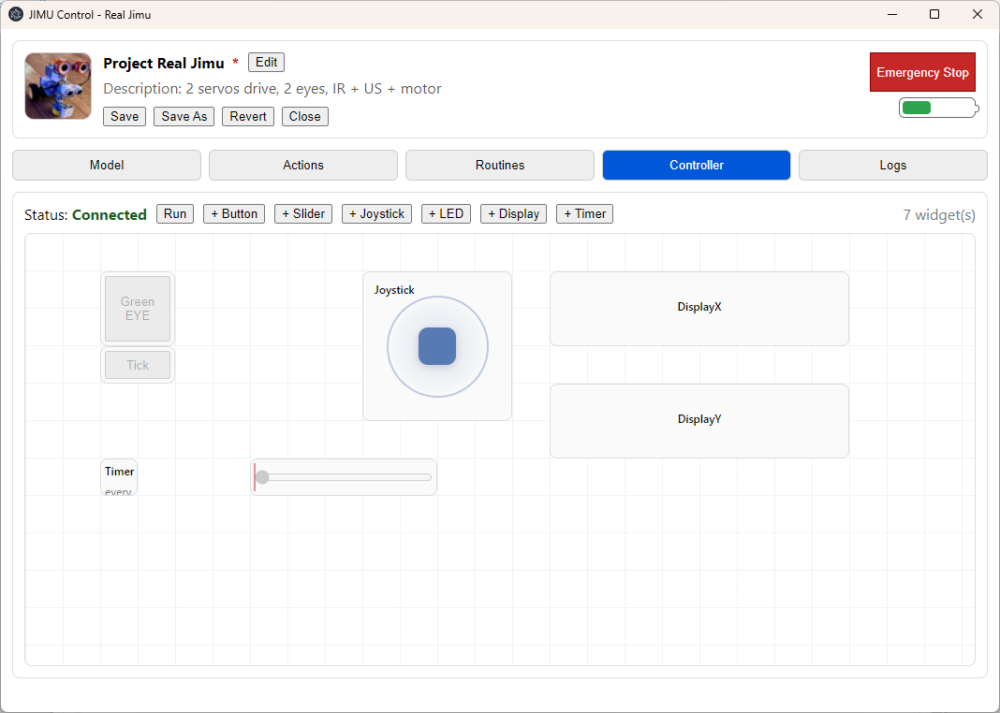
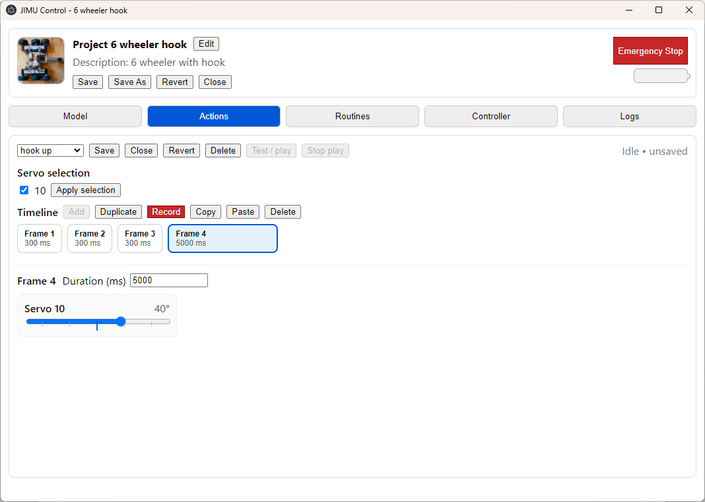

# JIMU Control

Block-based programming and live control app for **UBTECH JIMU** robots (Windows-first). Build Blockly programs, connect over Bluetooth to a Master Brick, and drive servos/motors + read sensors in real time.

> Not affiliated with UBTECH. This project documents and implements a reverse‑engineered JIMU BLE protocol.
> Asked UBTECH for extra functions in uKit EDU official app, never heard response.

## What you get
- **Desktop app** (Electron + React + Vite) designed for education and for fun + quick prototyping.
- **Device SDK** in `jimu/` that handles scan/connect/boot/status + common module commands.
- **Protocol documentation** in `docs/protocol.md` (public, working draft).
- **Probe scripts** in `probe/` for reverse-engineering and validating commands - DO NOT USE, WRONG USSAGE CAN DAMAGE YOUR JIMU!

## Hardware (photos)

## App screenshots

## Project status
- **Today (works in repo):** Most implemented: Electron shell, BLE scan/connect, boot/status parsing, battery, live Model Config panels, and real project save/load/edit (stored under `./jimu_saves/`), Actions editor + playback, Blockly Routines workspace with JIMU blocks, runtime scheduler (triggers), Controller widgets/bindings.
- **Next (app direction):** Tests... a lot of tests.
- **Known gaps:** installer/packaging, not tested.

More detail: `docs/project/status.md`

## Download & run (Windows)
Prereqs: Windows 10/11, Bluetooth adapter, Node.js LTS.

1) Clone  

`git clone https://github.com/<your-org>/JIMU-control.git`  

or download everything as zip and unpack

`cd JIMU-control`

2) Install deps  

`npm install`

3) Run dev (Vite + Electron)  WORKS!

`npm run dev`

 Ctrl+Shift+I  to show dev console for error checking

4) Build + run production shell  ... WORKS!

`npm run build`  
`npm start`

## Release (Windows .exe)
- Portable single-file `.exe`: `npm run release` (outputs to `release/`)
- Installer `.exe` (NSIS): `npm run release:win:setup` (outputs to `release/`)

Project storage:
- Dev: `./jimu_saves/`
- Packaged builds: Electron `userData` `jimu_saves/`

If `npm run release` fails with `Cannot create symbolic link ... A required privilege is not held by the client`, enable **Windows Developer Mode** (or run the build from an elevated/admin terminal).
To debug the release exe: `set JIMU_OPEN_DEVTOOLS=1&& .\\release\\JIMU-control 0.0.1.exe`

Production debugging:
- `set JIMU_OPEN_DEVTOOLS=1&& npm start` (enables Ctrl+Shift+I and opens DevTools after load)

Troubleshooting and BLE notes: `docs/getting-started/windows.md`

## Documentation
- Start here: `docs/index.md`
- Architecture (overview + links): `docs/architecture.md`
- JIMU Bluetooth protocol (reverse‑engineered): `docs/protocol.md`
- Scan captures/raw notes: `docs/scan_result.md`

## Contributing
- Workflow + doc conventions: `docs/contributing.md`

## AI Support
- This project was created by AI working under my supervision. 
- I don't write JavaScript programs, but I know a bit about software engineering and low-level protocols.
- For those curious, creating a system like this takes about two weeks of work and dozens, sometimes hundreds, of prompts per day.
- I reached the ChatGPT business limit several times.
- I was curious... what can be achieved with AI these days if it's properly supervised.

## Dislamer
- I'm not responsible for any damage to your JIMU.
- **Probes**: Are small programs that send unverified commands to JIMU, with the expectation to observe responses or actions by modules. Because they send many commands whose purpose is unknown, it is possible to destroy the brick itself or modules. Examples of those "destructions" include changing a module ID to an unsupported one, starting an upgrade process without providing valid code, etc. I have two modules (IR and EYE) that are no longer responding to any actions, including changing their IDs.

## License
See [LICENSE](LICENSE) (GPL v3).

## Links and explanations:
- [Electron](https://electronjs.org/) - a framework for building cross-platform desktop apps using web technologies.
- [React](https://reactjs.org/) - a JavaScript library for building user interfaces.
- [Vite](https://vitejs.dev/) - a development server and build tool for modern web applications.
- [Blockly](https://developers.google.com/blockly) - a visual programming language developed by Google.
- [BLE (Bluetooth Low Energy)](https://en.wikipedia.org/wiki/Bluetooth_Low_Energy) - a wireless personal area network technology designed for low-power consumption.

Note: This is a working draft, and some links may not be up-to-date or accurate. Please report any issues or suggestions to improve this documentation.
